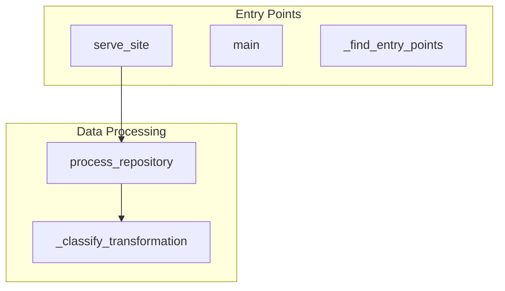
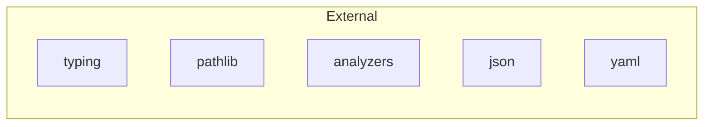

# Architecture Overview

## System Architecture

### Architecture Diagram

## High-Level Components

### Analyzers

**Type:** Analysis Components  
**Files:** 3  
**Key Functions:** 34

Contains 3 modules handling analysis components functionality.

### Generators

**Type:** Content Generators  
**Files:** 4  
**Key Functions:** 54

Contains 4 modules handling content generators functionality.

## Module Structure

### remote_editor

**Path:** `remote_editor.py`  
**Classes:** 1  
**Functions:** 6  
**Lines:** 258

Remote Repository Editor

Provides functionality to edit and commit to repositories remotely.

### __init__

**Path:** `__init__.py`  
**Classes:** 0  
**Functions:** 0  
**Lines:** 27

Auto Documentation Generator Package

A comprehensive automatic documentation generation system with AI/ML pipeline support.

### main

**Path:** `main.py`  
**Classes:** 0  
**Functions:** 8  
**Lines:** 365

Auto Documentation Generation System

This is the main entry point for the automatic code documentation generation system.
It analyzes Python codebases and generates comprehensive documentation.

### ai_pipeline_analyzer

**Path:** `analyzers/ai_pipeline_analyzer.py`  
**Classes:** 1  
**Functions:** 10  
**Lines:** 417

### __init__

**Path:** `analyzers/__init__.py`  
**Classes:** 0  
**Functions:** 0  
**Lines:** 9

Analyzers package for auto-doc-generator.

### code_analyzer

**Path:** `analyzers/code_analyzer.py`  
**Classes:** 1  
**Functions:** 24  
**Lines:** 778

### html_generator

**Path:** `generators/html_generator.py`  
**Classes:** 1  
**Functions:** 21  
**Lines:** 422

HTML Documentation Generator
Generates HTML documentation from analysis results using HTML templates.

### __init__

**Path:** `generators/__init__.py`  
**Classes:** 0  
**Functions:** 0  
**Lines:** 10

Generators package for auto-doc-generator.

### diagram_generator

**Path:** `generators/diagram_generator.py`  
**Classes:** 1  
**Functions:** 13  
**Lines:** 420

### markdown_generator

**Path:** `generators/markdown_generator.py`  
**Classes:** 1  
**Functions:** 20  
**Lines:** 1132

## Dependencies

### External Dependencies

- typing
- pathlib
- analyzers
- json
- yaml
- sys
- os
- diagram_generator
- ast
- main
- re
- subprocess
- diagrams
- code_analyzer
- logging
- shutil
- generators
- tempfile
- remote_editor
- html_generator
- datetime
- git
- radon
- argparse
- markdown_generator
- jinja2
- ai_pipeline_analyzer

### Internal Dependencies

The system has 0 internal module dependencies.

## Data Flow

### Entry Points

#### serve_site

**File:** `main.py:184`
**Parameters:** output_dir, port
Serve the documentation site locally.

#### main

**File:** `main.py:239`

Main entry point for the documentation generator.

#### _find_entry_points

**File:** `generators/html_generator.py:292`
**Parameters:** self, code_analysis
Find main entry points in the codebase.

#### _truncate_docstring

**File:** `generators/html_generator.py:395`
**Parameters:** self, docstring, max_length
Truncate docstring to specified length.

#### _truncate_docstring

**File:** `generators/markdown_generator.py:1019`
**Parameters:** self, docstring, length
Truncate docstring to specified length.

### Data Transformations

#### process_repository

**File:** `remote_editor.py:128`
**Type:** Processor
**Parameters:** self, repo_url, config_override, commit_message, branch
Complete workflow: clone, generate docs, commit, and push.

#### _classify_transformation

**File:** `analyzers/code_analyzer.py:696`
**Type:** Converter
**Parameters:** self, func_name
Classify the type of data transformation.

### Output Points

#### _classify_output

**File:** `analyzers/code_analyzer.py:715`
**Type:** Logging

Classify the type of output operation.

#### save_documentation

**File:** `generators/html_generator.py:184`
**Type:** Storage

Save generated documentation to files.

#### save_mermaid_diagrams

**File:** `generators/diagram_generator.py:406`
**Type:** Storage

Save Mermaid diagrams to markdown files.

#### save_documentation

**File:** `generators/markdown_generator.py:989`
**Type:** Storage

Save all generated documentation to files.

### Data Stores

#### load_config

**File:** `main.py:37`
**Type:** File_Reader

Load configuration from YAML file.

#### _get_node_name

**File:** `analyzers/ai_pipeline_analyzer.py:327`
**Type:** Data_Fetcher

Get string representation of AST node.

#### _get_node_name

**File:** `analyzers/code_analyzer.py:510`
**Type:** Data_Fetcher

Get string representation of AST node.

#### _find_entry_points

**File:** `generators/html_generator.py:292`
**Type:** Query_Engine

Find main entry points in the codebase.

#### _get_project_name

**File:** `generators/markdown_generator.py:1033`
**Type:** Data_Fetcher

Get project name from current directory.

#### _get_key_modules

**File:** `generators/markdown_generator.py:1084`
**Type:** Data_Fetcher

Get key modules for onboarding.

#### _get_module_description

**File:** `generators/markdown_generator.py:1104`
**Type:** Data_Fetcher

Get description for a module.

### Data Flow Chains

#### Flow starting from _find_entry_points

**Entry Point:** `_find_entry_points` in `generators/html_generator.py`

**Output:** `save_documentation` (storage) in `generators/html_generator.py`

---

### Data Flow Diagram

### Dependencies Diagram

## Architectural Layers

